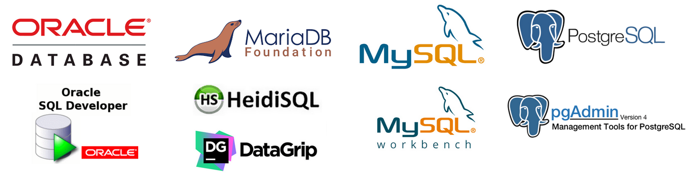

<h1 align="center">
  
</h1>

<h1 align="center">Database I and Database II</h1>

## Description

Project development for the Database I and Database II course at the Federal Institute of Pernambuco.

> Database I

Explain the fundamental concepts and operational aspects of a database, the various data models and apply methodologies for database analysis and design.

- Introduction to Databases ((Historical, DBMS, Conceptual, Logical and Physical Models).
- Entity-Relationship Model (MER).
- Relational Model, Integrity and MER-MR Mapping.
- Normalization.
- SQL language – DDL and DML and Views.
- Mysql and Postgresql database presentation.
- DB manipulation with Java and ORM.

> Database II

- Introduction to DBMS Implementation.
- Data storage.
- Structure of Indexes.
- Query Processing and Optimization.
- Tune in BD.
- Transaction Management.
- Concurrency Control.
- Recovery after Failures.
- Database Security.
- User Management.
- Introduction to Non-Relational Databases.

- [Project development of the 2nd unit: Infinity](https://github.com/thiagomvilela/infinity)

### 🛠 Technologies

The following tools were used in the construction of the project:

- [MySQL](https://www.mysql.com/)
- [MySQL Workbench](https://www.mysql.com/products/workbench/)
- [MariaDB](https://mariadb.org/)
- [HeidiSQL](https://www.heidisql.com/)
- [Oracle](https://www.oracle.com/br/)
- [Oracle SQL Developer](https://www.oracle.com/database/sqldeveloper/)
- [DataGrip](https://www.jetbrains.com/pt-br/datagrip/)
- [PostgreSQL](https://www.jetbrains.com/pt-br/datagrip/)
- [pgAdmin](https://www.pgadmin.org/)
