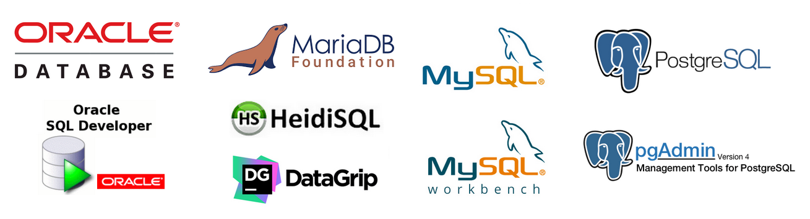

<h1 align="center">
  
</h1>

<h1 align="center">Database I and Database II</h1>

## Description

Project development for the Database I and Database II course at the Federal Institute of Pernambuco.

- Programming...

### 🛠 Technologies

The following tools were used in the construction of the project:

- [MySQL](https://www.mysql.com/)
- [MySQL Workbench](https://www.mysql.com/products/workbench/)
- [MariaDB](https://mariadb.org/)
- [HeidiSQL](https://www.heidisql.com/)
- [Oracle](https://www.oracle.com/br/)
- [DataGrip](https://www.jetbrains.com/pt-br/datagrip/)
